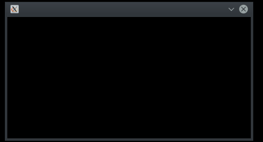
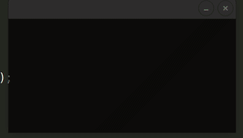
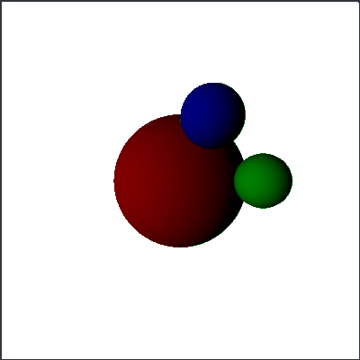

# RayTracing
A simple raytracer/renderer. The goal of the project is to implement some of the basic features that modern game engines offer, such as manipulating 3D objects in space, camera functionality, raytracing, etc. I am developing this project due to my interest in game dev and computer graphics and also as an exercise in C++ and OOP.

